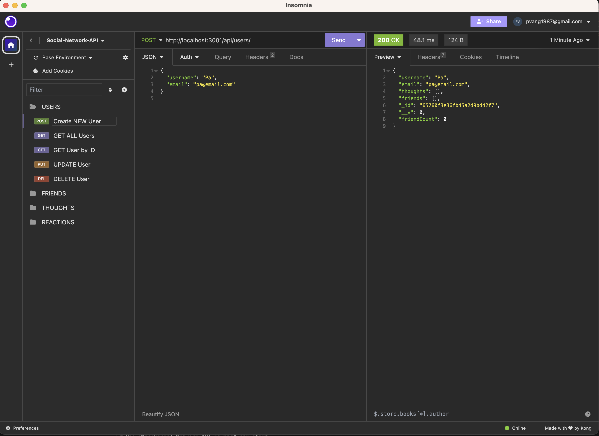

# Social-Network-API

This repo is used to house code for the NoSQL Social Network API Challenge

## User Story

AS A social media startup  
I WANT an API for my social network that uses a NoSQL database  
SO THAT my website can handle large amounts of unstructured data

## Acceptance Criteria

GIVEN a social network API  
WHEN I enter the command to invoke the application  
THEN my server is started and the Mongoose models are synced to the MongoDB database  
WHEN I open API GET routes in Insomnia for users and thoughts  
THEN the data for each of these routes is displayed in a formatted JSON  
WHEN I test API POST, PUT, and DELETE routes in Insomnia  
THEN I am able to successfully create, update, and delete users and thoughts in my database  
WHEN I test API POST and DELETE routes in Insomnia  
THEN I am able to successfully create and delete reactions to thoughts and add and remove friends to a user’s friend list

Repository Link: https://github.com/pvang1987/Social-Network-API  
Video Link: https://watch.screencastify.com/v/EcQdBoazXw9J3I3UKkvK
